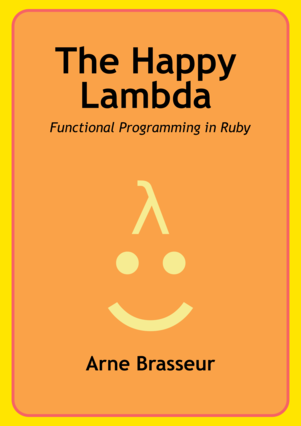

{:.title}
# Functional Programming in Ruby


Ryan (@itchyankles) and Arne (@plexus)

Rug-B 2013-11-07

---

## Values

---

## Freeze All The Things

---


---

```ruby
class BelgianFries
  attr_reader :size, :toppings

  def initialize(size, toppings)
    @size = size.freeze
    @toppings = toppings.freeze
  end
end
```

---

```ruby
class BelgianFries
  # ...

  def top_with(topping)
    self.class.new(size, toppings + [topping])
  end
end

friet = BelgianFries.new(:small, [])
# => #<BelgianFries @size=:small, @toppings=[]>

with_mayo = friet.top_with(:mayonaise)
# => #<BelgianFries @size=:small, @toppings=[:mayonaise]>

friet
# => #<BelgianFries @size=:small, @toppings=[]>
```

---

# Deep <strike>fry</strike> Freeze

```ruby
x = ['samurai saus'].freeze
x[0][0..-1]='mammoet saus'
x # => ['mammoet saus']
```

---

## Use attr_reader

```ruby
friet.size = :large

# undefined method `size=' for #<BelgianFries @toppings=[], @size=:small> (NoMethodError)
```

---

# Pure functions

---

## Methods

A "function" with an implicit self

```ruby
class Fries
  def crunchy?
    self.crunchiness > 97
  end
end
```

---

## Module functions

for when not feeling `self`ish

```ruby
module FunkyFry
  def mix(sauces)
    # ...
  end
  module_function :mix
end

FunkyFry.mix(sauces)
```

---

## It ain't a mutation if no one sees it

```ruby
def prepare_order(portions)
  result = []
  portions.each do |size|
    result << BelgianFries.new(size)
  end
  result.freeze
end
```

---

# Function Values

---

## Procs

```ruby
def visit_fry_shack(&customer)
  customer #=> #<Proc:...>
  customer.(fry_shack)

  # same thing
  # yield fry_shack

  # same thing
  # customer.call fry_shack
end
```

---

## Procs are "lambdas"

```ruby
improve = proc {|fries| fries.top_with(:more_mayonnaise) }
defile  = lambda {|fries| fries.top_with(:vinegar) }

tasty = improve.call(fries)
yukkk = defile.(fries)
```

---

## Lambdas are closures

```ruby
piet = HungryBelgian.new
devour = ->(fries) { piet.eat(fries) }
```

---

## Enumerable / Enumerator

```ruby
potatoes.flat_map(&:slice)
  .map {|f| fry.(f) }
  .reject {|f| f.black? }
  .inject(FryBag.new) {|f, bag| bag << f}
```

---

## Quack like a Proc

```ruby
class SliceAndDice
  def call(potato)
    # ... cut in fine strips ...
  end

  def to_proc
    method(:call).to_proc
  end
end

fries = potatoes.flat_map(&SliceAndDice.new)
```

---

## Enumerators!

```ruby
def fizz
  return to_enum(:fizz) unless block_given?
  loop { [nil, nil, "Fizz"].each{|s| yield s} }
end

def buzz
  return to_enum(:buzz) unless block_given?
  loop { [nil, nil, nil, nil, "Buzz"].each{|s| yield s} }
end

def fizzbuzz
  return to_enum(:fizzbuzz) unless block_given?
  f, b = fizz, buzz
  (1..Float::INFINITY).each do |i|
    fizzbuzz = [f, b].map(&:next).join
    yield fizzbuzz.empty? ? i : fizzbuzz
  end
end

fizzbuzz.lazy.map(&:to_s).map(&:upcase).take(10).to_a
# => ["1", "2", "FIZZ", "4", "BUZZ", "FIZZ", "7", "8", "FIZZ", "BUZZ"]
```

---

```
ri Proc
ri Enumerable
ri Enumerator
ri Method
```

---



[leanpub.com/happylambda](http://leanpub.com/happylambda)
